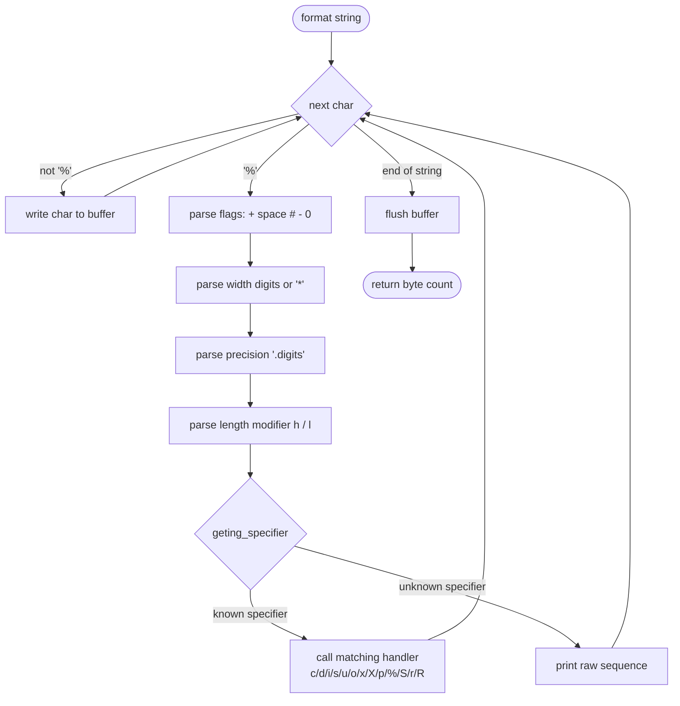

# printf

A from-scratch reimplementation of the C standard library's `printf` function. `_printf` parses a format string character by character, recognizes flags, field width, precision, and length modifiers, and dispatches each conversion specifier (`%d`, `%s`, `%c`, `%x`, `%o`, `%p`, `%u`, `%%`, and more, including two custom specifiers `%r` and `%R`) to a dedicated handler function, mirroring the behavior of the real `printf`.


## Features

- Supports the core conversion specifiers: `c`, `d`, `i`, `s`, `u`, `o`, `x`, `X`, `p`, `%`
- Supports flags: `+`, space, `#`, `-`, `0`
- Supports field width (including `*` for a width taken from the argument list) and precision
- Supports length modifiers `h` and `l`
- Two custom, non-standard specifiers: `%S` (safe string printing) and `%r`/`%R` (reversed / ROT13-style string printing)
- Handles unknown specifiers by printing them literally, like the real `printf`
- Buffered output via an internal write buffer, flushed at the end of each call
- `main.c` drives the implementation against the real `printf` for side-by-side comparison

## Tech Stack

- **Language:** C (C90-style, Betty-coding-style formatted)
- **Build:** compiled directly with `gcc`
- **No external dependencies** — only the standard library (`stdarg.h`, `stdio.h`, `unistd.h`, `limits.h`, `stdlib.h`)

## Project Structure

- `main.h` — shared declarations: the `parameters` (flags/width/precision/modifiers) and `specifier` (specifier-to-function lookup) structs, and all function prototypes
- `_printf.c` — the main `_printf()` function: walks the format string and drives parsing/dispatch
- `specifier.c` — specifier lookup table (`geting_specifier`), flag parsing (`geting_my_flag`), modifier parsing (`get_modifiers`), and width parsing (`get_widths5`)
- `print-functions.c` / `simple-printers.c` — handlers for `%c`, `%s`, `%%`, and the custom `%S` specifier
- `number.c` — integer/unsigned/pointer-address printing (`%d`/`%i`, `%u`, `%p`)
- `convert_number.c` — hexadecimal, octal, and binary conversion (`%x`, `%X`, `%o`, `%b`)
- `string-fields.c` / `params.c` — string field and precision helpers
- `_put.c` — low-level buffered character/string output (`_my_putchar`, `_my_puts`)
- `main.c` — sample program exercising `_printf` against the real `printf` for comparison
- `man_3_printf` — man-page-style documentation for the custom `_printf`

## Architecture

Format-string processing flow inside `_printf()`:



## Installation

```bash
git clone https://github.com/OmarElzero/printf.git
cd printf
gcc -Wall -Wextra -Werror -pedantic *.c -o printf_test
```

## Usage

```bash
./printf_test
```

`main.c` prints a series of formatted strings twice — once with `_printf` and once with the real `printf` — so the outputs can be diffed to verify correctness. Example from the source:

```c
_printf("String:[%s]\n", "I am a string !");
_printf("Unsigned hexadecimal:[%x, %X]\n", ui, ui);
```

To use `_printf` in your own code, include `main.h` and link against the compiled object files.

## Demo

No live demo is available for this project.

---

**Author:** OmarElzero · [GitHub](https://github.com/OmarElzero)
_Last updated: 2026-08-23_
